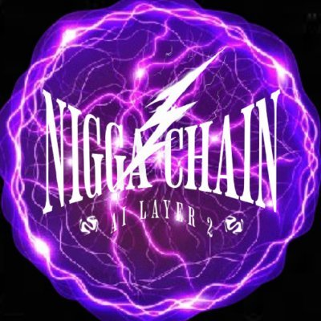

# NiggaChain AI L2

The first fully AI L2 blockchain built on Solana. Welcome to the future, nigga.

## Revolutionary Features

### Thermodynamic Bag Chaser Architecture

Allowing holders of $N2 to get significantly more money in less time than broke niggas not holding $N2.

### 0-Second Block Time

Via patent-pending One Gorillion TPS Transaction Speed.

### Quantum Disruption Hood Protection Mitigation Layers™ (QDHPML)

Leveraging Schrodinger's Cryptographic Encapsulation™ to protect against quantum computing attacks.

## Advanced Technologies

### Patented LLM (Lotta Lil Money's) technology

Designed to ensure transaction efficiency for users operating under resource-constrained conditions.

### PON (Proof of nigga) entry scan system

Bounces out suburban niggas with best-in-class efficiency, rectifying the only AI-powered Layer 2 that is truly by niggas, for niggas.

### Broke Nigga Detection Software with Liquidity Deficiency Nigga Analysis Nodes™ (LDNANs)

The network's AI identifies and adapts to low-resource users, employing Quantum Validation Protocols™ (QVP) to maintain system balance and detect wallet discrepancies.
